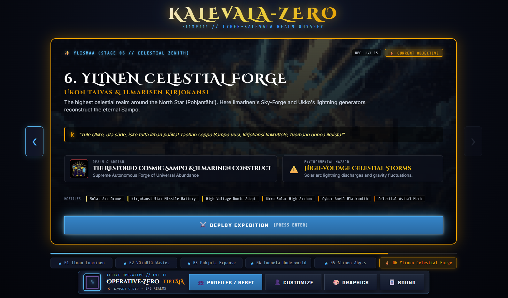
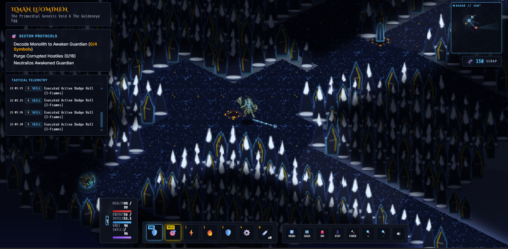
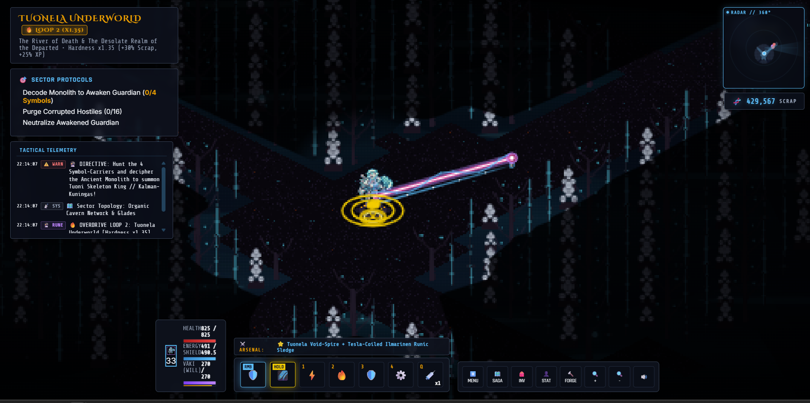
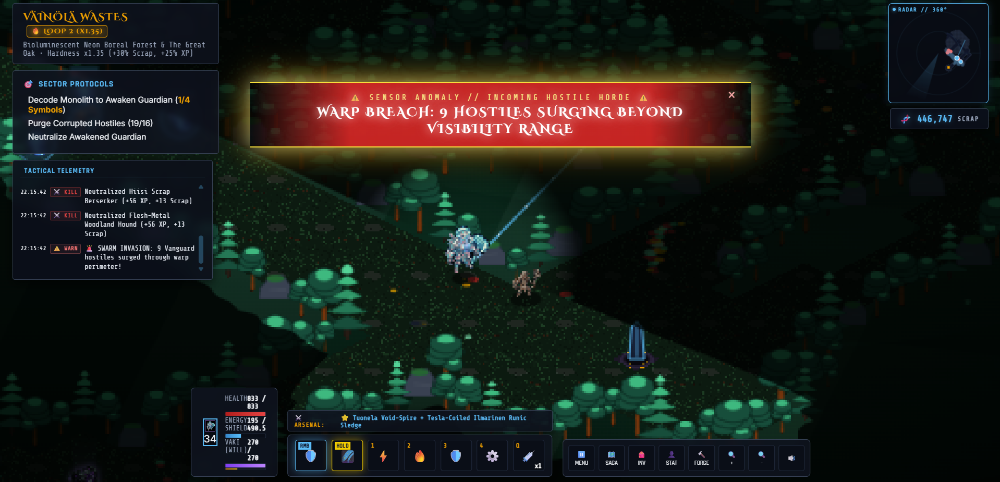
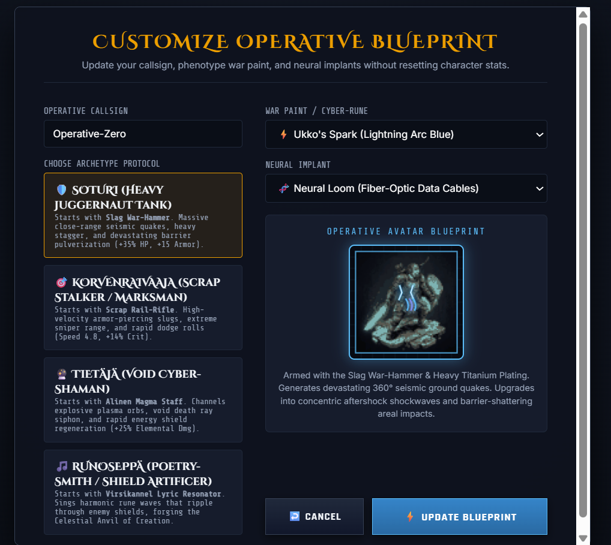
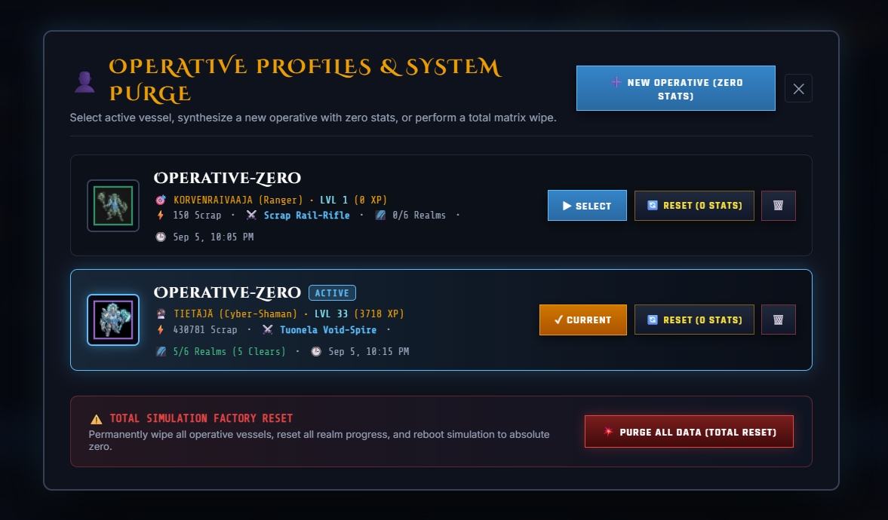
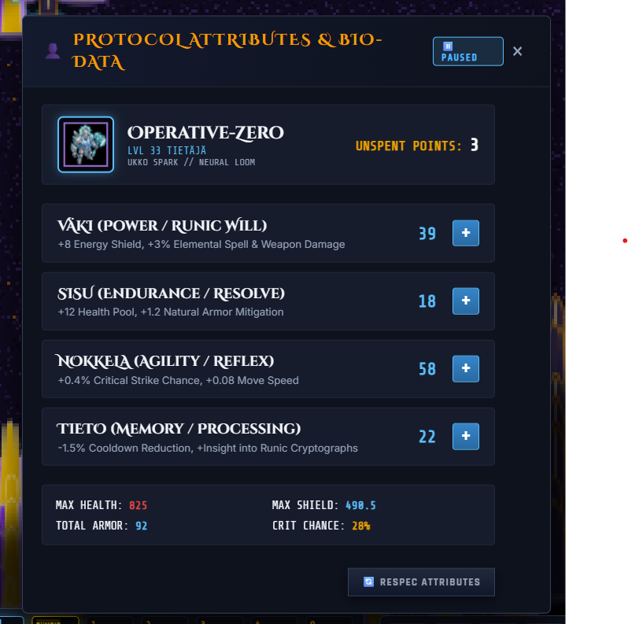

# KALEVALA-ZERO: Cyber-Kalevala Isometric ARPG

<div align="center">



[](https://github.com/honkamies/kalevala-zero/releases)
[](https://github.com/honkamies/kalevala-zero/actions)
[](https://github.com/honkamies/kalevala-zero/releases)
[](LICENSE)

> *"Centuries after the catastrophic meltdown and shattering of the Sampo—a mythic autonomous fusion-forge and matter synthesizer—the Northern wasteland lies fractured. Runic verses (*runolaulut*) are discovered to be corrupted low-level machine execution protocols, while mythical beasts roam as rogue biomechanical monstrosities."*

</div>

**Kalevala-Zero** is a dark isometric Action RPG / Dungeon Crawler combining ancient Finnish mythic folklore (*Kalevala* & *Kanteletar*) with post-apocalyptic sci-fi wasteland aesthetics. Experience fast-paced twin-stick tactical combat, modular nanite crafting, cumulative multi-weapon progression, procedural cosmological realms, visceral gore mechanics, and an epic boss rush climax.

---

## 📸 Visual Showcase

### In-Game Tactical Combat & Biomes

| Atmospheric Top-Down Combat | Cryo Fortresses & Biome Encounters |
| :---: | :---: |
|  |  |
| *Fast-paced tactical combat with dynamic shadows and runic projectile synergies* | *Procedurally generated Finnish cosmological realms and destructible rifts* |

### Climax Boss Rush & The Empty Void

<div align="center">



*Final arena confrontation against multi-phase colossal bosses and the Void Mist Overlord*

</div>

### Operative Synthesis, Customization & Biodata

| Operative Synthesis & Phenotype | Operative Customization | Biodata & Attribute Matrix |
| :---: | :---: | :---: |
|  |  |  |
| *Select between distinct operative archetypes with unique base weaponry* | *Customize phenotype appearance, cybernetics, and tactical callsign* | *Deep character sheet with respec capability and elemental scaling* |

---

## ⚔️ Key Gameplay Features

* **Unique Starting Weapons & Cumulative Progression:**
  - Each operative begins with an authentic, distinct base weapon tailored to their archetype:
    - **Soturi (Väinämöinen / Tank):** Heavy Kinetic Cleaver with sweeping cleave damage.
    - **Tietäjä (Ilmarinen / Shaman):** Void Caster launching homing entropic skulls.
    - **Korvenraivaaja (Joukahainen / Stalker):** High-velocity Precision Marksman Railgun with piercing slugs.
    - **Kulkuri (Lemminkäinen / Vagabond):** Rapid Dual Plasma Repeaters.
  - As you discover and equip new weapons, they **cumulate** into a simultaneous multi-weapon firing battery that intensifies across harder saga loops.

* **Cosmological Saga Adventure Path:**
  - Journey through 6 distinct realms ascending the ancient World Tree (*Maailmanpuu / Pohjantähti*):
    `[1. ILMAN LUOMINEN] ➔ [2. VÄINÖLÄ] ➔ [3. POHJOLA] ➔ [4. TUONELA] ➔ [5. ALINEN] ➔ [6. YLISMAA / SAMPO FORGE]`
  - Each realm features procedural tile architecture, environmental hazards, unique runic lore, and multi-phase guardian bosses.

* **Deep Combat Engine & Status Procs:**
  - Dynamic elemental damage types: **Physical**, **Plasma**, **Frost** (chilling slow), **Shock** (overcharge chain), **Fire** (burn over time), and **Void** (siphon & entropy).
  - Visceral hit reactions, screen shake, shockwaves, flying gore gibs, and localized hit flashing.

* **Zero-GC High-Performance Architecture:**
  - Memory-pooled projectile and floating text subsystems to eliminate garbage collection stutters during massive bullet-hell encounters.
  - Hardware-accelerated 2D canvas rendering with precalculated geometric caches and directional dynamic lighting.

* **Sample-Based Audio Engine:**
  - Production audio design with 100% sample-based sound effects, polyphony throttling, and ambient music jukebox with dual-deck crossfading.

---

## 🌌 The Cosmological Saga Realms

```
[1. ILMAN LUOMINEN] ➔ [2. VÄINÖLÄ] ➔ [3. POHJOLA] ➔ [4. TUONELA] ➔ [5. ALINEN] ➔ [6. YLISMAA / SAMPO FORGE]
```

1. **Stage 01 — Ilman Luominen (*Ilmattaren Aallot & Sotkan Muna*)**:
   - *Theme*: The primordial cosmic void before earth or sky took form.
   - *Boss*: **Sotka Cyber-Harbinger** (*Genesis Drone of the Golden Shells*).
   - *Verse*: *“Ei ollut maata, ei taivasta, ei merta eikä mannerta. Vain vesi vilisi aava, ilman impi ajelehti…”*

2. **Stage 02 — Väinölä Wastes (*Elävien Maa & Kalevalan Tantereet*)**:
   - *Theme*: The middle realm of mortals, glowing spruce forests around radio monoliths.
   - *Boss*: **Surma Cyber-Hound Alpha** (*Apex Flesh-Metal Stalker*).
   - *Verse*: *“Mieleni minun tekevi, aivoni ajattelevi, lähteäni laulamahan, saa'ani sanelemahan…”*

3. **Stage 03 — Pohjola Expanse (*Pimentola & Sariolan Kivimäki*)**:
   - *Theme*: Cryogenic frost fortresses shielding Louhi's Nine-Locked Copper Mountain.
   - *Boss*: **Louhi's Frost Guardian Unit 0-Zero** (*Matriarch War Drone*).
   - *Verse*: *“Pois on Pohjolan pimeys, kylmä kylän hallitseva, portit vaskiset vavahti, lukot yhdeksän aukesi…”*

4. **Stage 04 — Tuonela Sub-Levels (*Tuonen Musta Joki & Manala*)**:
   - *Theme*: The black coolant river where necrotic servitors drift in iron nets.
   - *Boss*: **Tuoni Death-Harvester & Tuonen Joutsen** (*Warden of the Coolant Abyss*).
   - *Verse*: *“Ei Tuonelta tulla vasta, Manalalta matkataan; Tuonen tytöt verkkoja kutoo, rautaisia rysänpohjia…”*

5. **Stage 05 — Alinen Abyss (*Syvyyksien Pohja & Iku-Turson Kita*)**:
   - *Theme*: Deep volcanic magma trenches and primordial sea bottom beneath creation.
   - *Boss*: **Iku-Turso Abyssal Construct** (*Leviathan of the Black Deep Trenches*).
   - *Verse*: *“Nousi Iku-Turso äijä, meren mustasta mudasta, parta vaahdossa vellova, syvyyksien valtias…”*

6. **Stage 06 — Ylinen Celestial Forge (*Ukon Taivas & Ilmarisen Kirjokansi*)**:
   - *Theme*: The high celestial stratosphere and rotating Sky-Forge at the North Star.
   - *Final Boss*: **The Restored Cosmic Sampo & Ilmarinen Construct** (*Supreme Forge of Abundance*).
   - *Verse*: *“Tule Ukko, ota säde, iske tulta ilman päältä! Taohan seppo Sampo uusi, kirjokansi kalkuttele!”*

---

## 🎮 Tactical Controls

| Action | Control |
| :--- | :--- |
| **Move / Navigate** | `W`, `A`, `S`, `D` or `Middle Mouse Button (Hold)` |
| **Aim & Attack** | `Mouse Pointer` + `Left Click` |
| **Active Dodge Roll** | `Spacebar` |
| **Ability 1 (Ukonvasara - Lightning Slam)** | `1` |
| **Ability 2 (Kipinä Dash - Plasma Jet)** | `2` |
| **Ability 3 (Tuoni Siphon - Shield Barrier)**| `3` |
| **Ability 4 (Sampo Overclock - Ultimate)** | `4` or `R` |
| **Nano-Repair Injector (Heal)** | `Q` or `5` |
| **Kalevala Saga Map** | `ESC` or `Saga Icon in HUD` |
| **Inventory & Gear Paperdoll** | `I` or `Tab` |
| **Character Sheet & Stat Allocator** | `C` |
| **Nanite Forge & Socketing** | `F` |
| **Mute / Unmute Audio** | `M` |

---

## 👤 Operative Profiles & Total Reset System

- **Multi-Profile Management**: Create and switch between multiple distinct operative vessels (`GameProfile`).
- **Fresh Zero-Stat Character Creation**: Synthesize brand-new characters with Level 1, 0 XP, base archetype attributes, empty backpacks, and independent realm progression.
- **Per-Operative Reset**: Reset any existing operative back to Level 1 and 0 stats while preserving callsign/phenotype.
- **Total Factory Reset**: One-click complete simulation purge that wipes all profiles and local data, rebooting Kalevala Zero to a pristine installation state.
- **Attribute Respec**: Instant refund of spent attribute points in the Character Sheet (`C`).

---

## 🚀 Running & Deployment

### Local Development Server
```bash
# 1. Start backend server
cd server
npm run build && npm start

# 2. Start client web app
cd client
npm run build
npm run preview
```
Accessible at `http://localhost:5173`.

### Desktop Windows Executable
To package a standalone Windows x64 portable executable:
```bash
cd desktop
npm run build:exe
```
Output artifact: `desktop/release/Kalevala-Zero-v1.1.0.exe`.

---

## 📜 License & Credits

- **Game Engine & Code**: MIT License.
- **Folklore & Texts**: Based on the Finnish national epic *Kalevala* and lyric collection *Kanteletar* by Elias Lönnrot (Public Domain).

